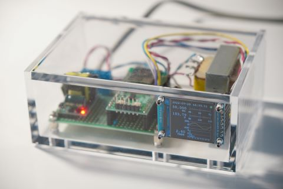

# Volquo_ESP32
Monitoring and recording of the AC outlet voltage quality by ESP32

## Hardware
This is an Arduino project for an ESP32 microcontroller to monitor and record the AC 100-V outlet voltage quolity, namely, frequency, RMS voltage, and harmonic spectrum.

The picture and the diagram above show the hardware on which this Arduino project runs. The AC 100-V outlet voltage is detected by the transformer and the voltage division network connected to GPIO35 of the ESP32 microcontroller (on Akizuki Denshi Tsusho's AE-ESP32-WROOM-32E-MINI). The software in this repository calculates frequency, RMS value, and spectrun (by FFT) and shows them on an 240 \times; 240 color LCD. The control of LCD depends on the Lovyan GFX library.

The detail of this project is described in my [blog post](https://negligible.hatenablog.com/entry/2022/07/26/030918) (in Japanese).
